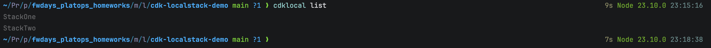

# Welcome to my CDK TypeScript project

This is a blank project for CDK development with TypeScript.

## Steps:
1. Started LocalStack 
2. Init CDK App 
3. List local stacks 
4. CDK Bootstrap 
5. CDK Diff 
6. Check deployed S3 buckets 